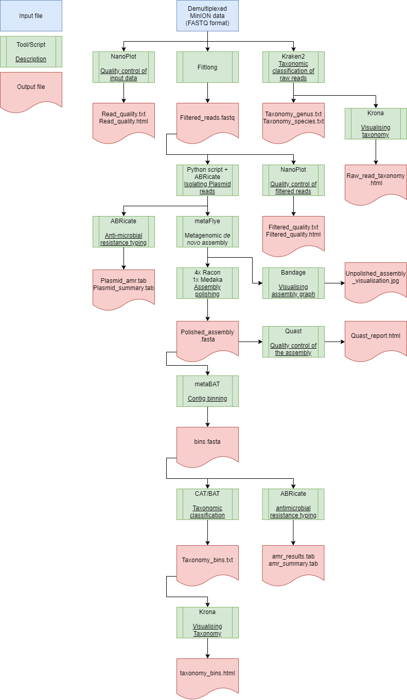

# MetaGalaxy

A pipeline for metagenomic assembly and analysis, that can also be used on Galaxy

An overview of the pipeline is given below:


The report describing MetaGalaxy and some benchmarks can be found [Here](https://github.com/mdcjansen/MetaGalaxy/blob/master/MetaGalaxy.pdf)

## Table of contents

* [Requirements](#Requirements)
* [Installation](#Installation)
* [Example commands](#commands)
* [Full usage](#Full-usage)
* [Method](#Method)
* [Interpeting output](#Interpeting-output)
* [Acknowledgements](#Acknowledgements)
* [License](#License)


## Requirements and dependencies

* Linux
* Python 3.6
* Java
* Anaconda3


## Installation

Install dependecies:
```
sudo apt-get install -y build-essential git qtbase5-dev libqt5svg5-dev libboost-all-dev curl libncurses5-dev zlib1g-dev pkg-config libfreetype6-dev libpng-dev cmake gcc g++ libbz2-dev liblzma-dev autoconf python-setuptools
```

Install MetaGalaxy:
```
git clone https://github.com/mdcjansen/MetaGalaxy
cd path/to/MetaGalaxy
conda env create -f environment.yml
chmod a+x bin/MetaGalaxy.py
```

Install the tools:
```
cd lib
chmod a+x install.sh
./install.sh
```

MetaGalaxy does not provide Guppy with its distribution.
Guppy can be downloaded and install from the Oxford Nanopore technologies [website](https://community.nanoporetech.com/protocols/Guppy-protocol/v/GPB_2003_v1_revM_14Dec2018)

Install the databases:
```
cd data
chmod a+x install.sh
./install_database.py
```

It is possible to create your own databases for the tool as long as the folder structure is the same as the default folder structure of the tool.
Building the databases may take several hours depending on the system configuration

Make MetaGalaxy executable from within the anaconda environment:
```
ln -s path/to/Metagalaxy/bin/MetaGalaxy.py path/to/anaconda3/envs/metagalaxy/bin/MetaGalaxy
```

## Example commands

Some tools and depencecies used by MetaGalaxy are installed in the conda environment. This environment must be activated, to ensure that the analysis runs smoothly.
```
conda activate metagalaxy
```

#### Default settings

This will run MetaGalaxy with the default parameters
```
metagalaxy -i <input_file> -o <output_directory>
```


#### Demultiplexing

The first command will print all the barcoding kits available for demultiplexing. The second command will start the demultiplexing process.
```
metagalaxy --bc_avail
metagalaxy --demulitplex --bc_kit <barcoding_kit> -i <input_directory> -o <output_directory>
```


#### Keep all files produced

This will run MetaGalaxy as normal, but it will not clean up the additional files created during analysis
```
metagalaxy -i <input_file> -o <output_directory> -t <threads> --keep
```


## Full Usage
```
usage: MetaGalaxy -i <inputfile> [options]

MetaGalaxy is designed to identify bacteria from metagenomic samples and
detect their AMR genes. It uses basecalled nanopore data in fastq format.
Ensure that the conda environment is activated before using this pipeline
[conda activate metagalaxy].

Arguments for Metagalaxy:
  -h, --help        show this help message and exit
  -v, --version     Prints program version and exits Metagalaxy
  -i [input]        Input .fastq file for analysis or file directory for
                    demultiplexing
  -o [output]       Output directory
  -t [threads]      Amount of threads [56]
  -g [gsize]        Esitmated genome size [100m]
  --demultiplex []  MetaGalaxy will demultiplex the files from the specified
                    input directory and trim the barcodes
  --bc_kit []       Specify the barcoding kit for demultiplexing. Only
                    required when used in conjunction with --demultiplex
  --bc_avail []     Prints all the available barcoding kits for demultiplexing
                    and exits Metagalaxy
  --keep []         Keep all files produced by MetaGalaxy

Thank you for using MetaGalaxy!
```


## Method

Metagalaxy will carry out the following steps during analysis:
1. Metagalaxy will perform taxonomic classification on the raw input file
		* Taxonomic classification is performed by Kraken2
		* Classification is performed with the use of a protein and nucleotide database
2. Simultaneously, Metagalaxy will asses the quality of the reads and filter out the short reads
		* The quality of the reads is calculated by NanoPlot
		* The reads shorter than 1Kbp or below a quality score of 7 are filtered out by Filtlong
3. After filtering on quality, plasmid reads are isolated an analysed
		* Plasmid reads are identified with ABRicate and the PlasmidFinder database.
		* These reads are then extracted from the main FASTQ file with a python script
		* ABRicate is used to screen the reads for AMR genes
3. After the reads are filtered, Metagalaxy will assemble the reads and polish the assembly
		* Assembly is performed by Flye with the --meta option
		* The first four rounds of polishing are performed by Racon
		* The last polishing round is performed by Medaka
4. After assembly, there is an assesment of the quality of the assembly and the assembly will also be visualised
		* The quality assessment is performed by Quast
		* The assembly graph is visualised by Bandage
5. The assembly will be binned, the bins are then taxonomicially classified and the bins will be screened for antimicrobial resistance genes
		* The binning is performed by MetaBAT
		* The taxonomic classification is performed by CAT/BAT
		* The screening for antimicrobial resistance genes is done by ABRicate, which uses the ResFinder database for the screening


## Interpeting output

Metagalaxy will produce numerous output files for all the individual analysis. Here, all the outputs are explained. The files that are by default cleaned up, are not explained in great detail.


#### Taxonomic classification on the raw input file

The first step will produce the folder "raw_read_quality" which contains four output files, two for each database used. 
These files are named: raw_taxonomy_genus_.txt or raw_taxonomy_species_.txt and have either the suffix ndb or pdb, which specifies if the nucleotide database or protein database has been used to generate the results.
The files look like this:

Coverage in Percentage|Covered fragments|Assigned fragments|Rank code|NCBI ID|Scientific name
--- | --- | --- | --- | --- | ---
86.62|1120718|2668|G|561|Escherichia
3.85|49777|14|G|1350|Enterococcus
6.50|84085|0|G|9605|Homo

Where the percentage is the percentage of fragments covered by the clade at the specific taxon, and the covered fragments are the number of fragments covered by the clade. The assigned fragments are the number of fragments directly assigned to the taxon. The rank code specifies the taxonomic rank. The NCBI ID is the NCBI taxonomic ID number.

Aside from the text files, two Krona charts will be made as well. One chart displays the taxonomies found in the nucleotide database and the other chart displays the taxonomies found in the protein database. The chart shows the abundance of the predicted taxon in percentage

#### Raw read quality asssessment and short read filtering

NanoPlot is used to assess the quality of the raw and filtered reads. The results of the analysis are stored in the "raw_read_quality" and "filtered_read_quality" directory.<br/>
This tool produces a html file which can be viewed in any modern browser (Edge, Chrome, Firefox). The html file contains a statistical summary on the reads which includes data on the mean and median read length and quality, N50, total bases and top 5 quality reads and read length. The summary can also be viewed in the text file included in the same directory.<br/>

The report also includes multiple histograms which display the read length before and after log transformation; and read length vs read quality plots.

The filtered reads are put in a new .fastq file which has been named filtered.fastq

#### Plasmid isolation and analysis

After the reads have been filtered by Filtlong, the FASTQ file is screened for plasmid reads by ABRicate. A reads is considered to be from a plasmid when ABRicate finds a hit against the PlasmidFinder database with a minimum coverage and identity of 60%.
These reads will then be extracted from the filtered.fastq file by a python script. After extraction these reads are screened again for AMR genes.
The output of this AMR screening looks similar to the table shown (below)[####Binning]. There is one main difference between this screening and the AMR screening done later on the bins. When the plasmid reads are screened, ABRicate will a gene everytime it is found. This means that when a particular gene is covered ten times, the output file will show that particular gene ten times.
When the screening is done on the bins. ABRicate will only report once on any found gene, unless there are duplicates present in the bin.

#### Assembly, polishing, visualisation and quality assessment

Flye produces multiple files including the final assembly in .fasta format and an assembly graph in .gfa format. The final assembly is used as input for mapping with minimap2, and polishing with Racon and Medaka. The final consensus that is produced by Medaka, is used by Quast.<br/> 
Quast produces an html file that when viewed will show a detailed report on the quality of the assembly. Some of the reported results are: Genome fraction (%), NGA50, N50, number of contigs, largest contig size and total contig length.<br/>
The assembly graph is used by Bandage to create a .jpg image in which the assembled contigs are visualised.<br/>


#### Binning, taxonomic assignment and antimicrobial resistance(AMR)

The bins discovered by MetaBAT saved as FASTA format in the "meta_bins" folder.
Individual bins are taxonomically classified and summarized by CAT/BAT. The summary is saved as "taxonomy_bins.txt" and is a tab-delimited file, which contains the name of the bin, whether or not it has been classified, the lineage, the lineage score and the taxonomy from the superkingdom downwards. An example is shown below:

bin|classification|reason|lineage|lineage scores|superkingdom|phylum|class|order|family|genus|species
--- | --- | --- | --- | --- | --- | --- | --- | --- | --- | --- | ---
bin.1.fa|classified|based on 5466/5482 ORFs|1;131567;2;1224;1236;91347;543;561;562|1.00;0.93;0.81;0.25;0.21;0.20;0.20;0.10;0.08|Bacteria: 0.81|Proteobacteria: 0.25|Gammaproteobacteria: 0.21|Enterobacterales: 0.20|Enterobacteriaceae: 0.20|Escherichia: 0.10|Escherichia coli: 0.08
bin.2.fa|classified|based on 4014/4056 ORFs|1;131567;2;1783272;1239;91061;186826;81852;1350;1351|1.00;1.00;0.99;0.11;0.08;0.08;0.07;0.07;0.07;0.05|Bacteria: 0.99|Firmicutes: 0.08|Bacilli: 0.08|Lactobacillales: 0.07|Enterococcaceae: 0.07|Enterococcus: 0.07|Enterococcus faecalis: 0.05
bin.lowDepth.fa|classified(1/4)|based on 407/453 ORFs|1;131567;2;1783270;68336;976;200643;171549;171551;836;2645799;1739529|1.00;1.00;1.00;0.24;0.24;0.24;0.24;0.24;0.22;0.21;0.06;0.06|Bacteria: 1.00|Bacteroidetes: 0.24|Bacteroidia: 0.24|Bacteroidales: 0.24|Porphyromonadaceae: 0.22|Porphyromonas: 0.21|Porphyromonas sp. HMSC077F02: 0.06
bin.lowDepth.fa|classified(2/4)|based on 407/453 ORFs|1;131567;2;1783272;1239;91061;186826;186827;66831;137730|1.00;1.00;1.00;0.39;0.35;0.35;0.35;0.34;0.33;0.33|Bacteria: 1.00	Firmicutes: 0.35|Bacilli: 0.35|Lactobacillales: 0.35|Aerococcaceae: 0.34|Facklamia: 0.33|Facklamia ignava: 0.33
bin.lowDepth.fa|classified(3/4)|based on 407/453 ORFs|1;131567;2;1224;68525;29547;213849;72294;194;827|1.00;1.00;1.00;0.16;0.16;0.16;0.16;0.15;0.15;0.14|Bacteria: 1.00	Proteobacteria: 0.16|Epsilonproteobacteria: 0.16|Campylobacterales: 0.16|Campylobacteraceae: 0.15|Campylobacter: 0.15|Campylobacter ureolyticus: 0.14
bin.lowDepth.fa|classified(4/4)|based on 407/453 ORFs|1;131567;2;1783272;201174;1760;2037;2049;1069494|1.00;1.00;1.00;0.39;0.03;0.03;0.03;0.03;0.03|Bacteria: 1.00|Actinobacteria: 0.03|Actinobacteria: 0.03|Actinomycetales: 0.03|Actinomycetaceae: 0.03|Trueperella: 0.03|not classified
bin.tooShort.fa|classified|based on 2/4 ORFs|1;131567;2759;33630;5794;422676;5819;1639119;5820;418103;36330;864142|1.00;1.00;0.52;0.52;0.52;0.52;0.52;0.52;0.52;0.52;0.52;0.52|Eukaryota: 0.52|Apicomplexa: 0.52|Aconoidasida: 0.52|Haemosporida: 0.52|Plasmodiidae: 0.52|Plasmodium: 0.52|Plasmodium ovale: 0.52

Aside from the tab-delimited file, a Krona chart is created from the taxonomic assignment. The chart shows which organisms have been identified across all the bins. The abundance of the organisms is displayed in percentage

Antimicrobial resistance (AMR) genes are predicted by ABRicate and it produces two tab delimited files: "amr_results.tab" and "amr_summary.tab".</br>
The first file looks like this:

FILE|SEQUENCE|START|END|STRAND|GENE|COVERAGE|COVERAGE_MAP|GAPS|%COVERAGE|%IDENTITY|DATABASE|ACCESSION|PRODUCT|RESISTANCE
--- | --- | --- | --- | --- | --- | --- | --- | --- | --- | --- | --- | --- | --- | ---
bin.1.fa|contig_2:1.0-4689146.0|6346|7578|-|mdf(A)_1|1-1233/1233|===============|0/0|100.00|97.97|resfinder|Y08743|mdf(A)	
bin.1.fa|contig_2:1.0-4689146.0|549616|549971|-|tet(34)_1|66-421/465|.=======/=====.|2/2|76.34|74.79|resfinder|AB061440|tet(34)	
bin.1.fa|contig_2:1.0-4689146.0|1096532|1097632|+|blaCFE-1_1|37-1146/1146|========/======|5/19|95.64|71.66|resfinder|AB107899|blaCFE-1	
bin.1.fa|contig_2:1.0-4689146.0|3007312|3007616|-|oqxB_1|2660-2964/3153|......../...===|2/6|9.58|68.18|resfinder|EU370913|oqxB|Nalidixic_acid;Ciprofloxacin
bin.2.fa|contig_18:1.0-2132224.0|101057|102558|+|lsa(A)_1|1-1497/1497|========/======|5/5|100.00|98.94|resfinder|AY225127|lsa(A)|Lincomycin;Clindamycin;Dalfopristin;Pristinamycin_IIA;Virginiamycin_M
bin.2.fa|contig_18:1.0-2132224.0|855358|855596|+|tetB(60)_1|1444-1682/1740|......../...===|8/16|13.28|71.66|resfinder|KX000273|tetB(60)|Doxycycline;Tetracycline;Tigecycline

With each of the columns displaying this information:
1. The name of the bin
2. The sequence within the bin that contains the amr gene
3. The start coordinate of the identified gene
4. The end coordinate of the identified gene
5. On which strand the gene is located.
	* Forward strand (+)
	* Reverse strand (-)
6. Gene name
7. Proportion of the gene in the input sequence
8. Visual representation ```=```=aligned, ```.```=unaligned, ```/```=has gap
9. Openings/gaps in subject and query
10. Gene coverage in percentage
11. Nucleotide coverage in percentage
12. Database used to obtain the gene sequence
13. Genomic source of the sequence
14. Gene product
15. Putative antibiotic resistace phenotype

The summary file, summarises all found genes into a single file, which looks like this:

FILE|NUM_FOUND|blaCFE-1_1|lsa(A)_1|mdf(A)_1|oqxB_1|tet(34)_1|tetB(60)_1
--- | --- | --- | --- | --- | --- | --- | ---
bin.1.fa|4|95.64|.|100.00|9.58|76.34|.
bin.2.fa|2|.|100.00	||.|.|13.28

Where the first column displays the name of the bin; the second column displays how many amr genes were found in a specific bin; and all following columns display the coverage of each amr gene found in a bin in percentage. When a bin does not contain a specific amr gene, a "." is placed in that cell.


## Acknowledgements

Metagalaxy uses the following tools in the pipeline:
* [ABRicate](https://github.com/tseemann/abricate)
	* [Resfinder database](https://www.ncbi.nlm.nih.gov/pubmed/22782487)
	* [PlasmidFinder database](https://www.ncbi.nlm.nih.gov/pubmed/24777092)
* [Bandage](http://bioinformatics.oxfordjournals.org/content/31/20/3350)
* [BLAST](https://doi.org/10.1186/1471-2105-10-421)
* [CAT/BAT](https://github.com/sharkdp/bat)
* [DIAMOND](https://doi.org/10.1038/nmeth.3176)
* [Filtlong](https://github.com/rrwick/Filtlong)
* [Flye](https://doi.org/10.1038/s41587-019-0072-8)
* [Guppy](https://community.nanoporetech.com/protocols/Guppy-protocol/v/GPB_2003_v1_revM_14Dec2018)
* [Hmmer](http://nar.oxfordjournals.org/content/41/12/e121.long)
* [htslib](https://github.com/samtools/htslib)
* [Kraken2](http://genomebiology.com/2014/15/3/R46)
* [Krona](http://www.ncbi.nlm.nih.gov/pubmed/21961884)
* [Medaka](https://github.com/nanoporetech/medaka)
* [metaBAT](https://bitbucket.org/berkeleylab/metabat/src/master/)
* [Minimap2](https://doi.org/10.1093/bioinformatics/bty191)
* [NanoComp](https://academic.oup.com/bioinformatics/advance-article/doi/10.1093/bioinformatics/bty149/4934939)
* [NanoPlot](https://academic.oup.com/bioinformatics/advance-article/doi/10.1093/bioinformatics/bty149/4934939)
* [NanoStat](https://academic.oup.com/bioinformatics/advance-article/doi/10.1093/bioinformatics/bty149/4934939)
* [pplacer](https://github.com/matsen/pplacer)
* [Prodigal](https://github.com/hyattpd/Prodigal)
* [Quast](http://bioinformatics.oxfordjournals.org/content/29/8/1072.abstract?keytype=ref&ijkey=Kzq9lhMayiqecq9)
* [Racon](https://github.com/lbcb-sci/racon)
* [Samtools](http://www.ncbi.nlm.nih.gov/pubmed/19505943)


## License

[GNU General Public License, version 3](https://www.gnu.org/licenses/gpl-3.0.html)
